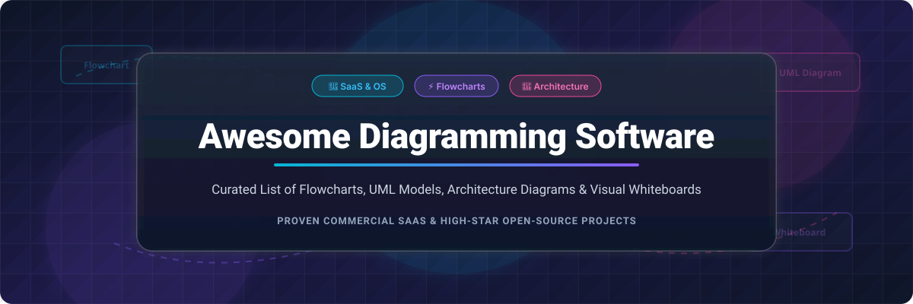

  
  
  
  
  
  
  

  

# 🎨 Awesome Diagramming Software

> **Curated List of Commercial SaaS Platforms & Open-Source GitHub Projects for Flowcharts, UML Models, Architecture Diagrams & Visual Collaboration**

Welcome to **Awesome Diagramming Software**, the definitive guide for software architects, developers, product managers, and visual thinkers. Whether you need an enterprise-grade cloud collaboration whiteboard, automated code-to-diagram generators, database ER models, or self-hosted open-source drawing suites, this list has you covered!

---

## 📖 Table of Contents

- [📌 Market Insights & Overview](#-market-insights--overview)
- [💼 Commercial SaaS Tools](#-commercial-saas-tools)
- [🔓 Open-Source GitHub Projects](#-open-source-github-projects)
- [🤝 How to Contribute](#-how-to-contribute)
- [⭐ Star History](#-star-history)
- [☕ Support & Community](#-support--community)
- [⚠️ Disclaimer](#-disclaimer)

---

## 📌 Market Insights & Overview

The **global diagramming and visual collaboration software market** is estimated at **~$11.5 Billion** in 2026 and is projected to expand at a **CAGR of ~12.5%** over the decade. 

The sector is **moderately fragmented**: rather than a single winner-take-all monopoly, the market is divided across:
1. **Ecosystem-Integrated Enterprise Tools** (e.g., Microsoft Visio, Gliffy for Atlassian).
2. **Infinite Canvas & Whiteboard Suites** (e.g., Miro, Lucidchart).
3. **Developer-First & Code-to-Diagram Projects** (e.g., Mermaid, PlantUML, Excalidraw, draw.io).

---

## 💼 Commercial SaaS Tools

Below is a curated comparison of leading commercial SaaS diagramming applications, sorted in descending order by company scale (revenue or valuation).

> **📈 Sector Dynamics**: The market estimated size is **~$11.5 Billion**, featuring **moderate fragmentation**. Proprietary solutions provide managed enterprise security, cloud sync, and deep SaaS integrations, while open-source tools offer local-first privacy and zero lock-in.

| Tool 🛠️ | Description 📝 | Pricing (Starting Tier) 💵 | Free Tier Limits 🎁 | Valuation / Revenue 📈 |
| :--- | :--- | :--- | :--- | :--- |
| **[Microsoft Visio](https://www.microsoft.com/en-us/microsoft-365/visio)** | **Enterprise vector diagramming suite.** Flowcharts, org charts, network diagrams, and CAD-like floor plans deeply tied into Microsoft 365. | **$5.00/user/month** (Visio Plan 1 annual) or **$15.00/user/month** (Plan 2) | **30-day free trial** for Plan 1/2; free read-only viewing via web/M365 Visio Viewer | **~$245.0 Billion Revenue** *(Microsoft parent)* |
| **[Miro](https://miro.com/)** | **Collaborative visual whiteboard platform.** Infinite canvas, real-time multiplayer cursor, templates, and AI diagramming generators. | **$8.00/member/month** (Starter billed annually) or **$10.00** monthly | **Free forever**: 3 editable boards, 10 AI credits/mo, premade templates, unlimited team members | **~$17.5 Billion Valuation** |
| **[Lucidchart](https://www.lucidchart.com/)** | **Intelligent cloud diagramming app.** Real-time collaboration, auto-visualizations, and integrations with Google Workspace, Jira, and Slack. | **$7.95/month** (Individual billed annually) or **$9.00/user/month** (Team) | **Free forever**: 3 editable documents, max 60 shapes per document, 100 basic templates | **~$3.0 Billion Valuation** |
| **[Gliffy](https://www.gliffy.com/)** | **Atlassian-native diagramming tool.** Direct integration for creating flowcharts and architecture models inside Confluence and Jira. | **$3.80/user/month** (Confluence Cloud for 11–100 users, annual) | **Free forever** for teams up to 10 users on Confluence Cloud; 14-day free trial for Jira | **~$1.5 Billion Valuation** *(Perforce parent)* |
| **[draw.io (diagrams.net)](https://www.drawio.com/)** | **Popular enterprise diagram editor.** Apache 2.0 open-core web & desktop tool with cloud connectors and Atlassian extensions. | **$0.08–$2.02/user/month** (Confluence Cloud app); free standalone web/desktop editor | **Free forever** for standalone web/desktop editor; free for ≤10 users on Atlassian Marketplace | **~$100.0 Million Revenue** *(Seibert Media)* |
| **[SmartDraw](https://www.smartdraw.com/)** | **Automated enterprise diagramming.** Creates flowcharts and org charts automatically from external data sources and CSV inputs. | **$9.95/month** (Individual annual) or **$5.95/user/month** (Team 5+ users) | **7-day free trial** with full feature access and export limits; no perpetual free tier | **~$50.0 Million Revenue** |
| **[Creately](https://creately.com/)** | **Data-driven visual workspace.** Connects diagram shapes to database fields, project tasks, and genograms. | **$5.00/user/month** (Starter annual) or **$8.00/month** monthly | **Free forever**: 3 documents, 60 items, limited storage and export resolution | **~$50.0 Million Valuation** |
| **[Visual Paradigm](https://www.visual-paradigm.com/)** | **UML & SysML enterprise modeling environment.** Comprehensive software architecture, BPMN, and Agile user story diagrams. | **$6.00/user/month** (Modeller edition annual) or **$15.00/user/month** (Combo) | **30-day free trial** for online subscriber tools; free Community Edition for non-commercial UML | **~$30.0 Million Revenue** |
| **[Cacoo](https://cacoo.com/)** | **Cloud real-time diagramming by Nulab.** Collaborative flowcharting, wireframing, and multi-user cursor editing. | **$6.00/user/month** (Billed annually) or **$66.00/year** (Space plan options) | **Free forever**: 6 sheets, 500 items per sheet, max 2 users, PNG export | **~$25.0 Million Market Cap** *(Nulab Inc. TSE:5032)* |
| **[OmniGraffle](https://www.omnigroup.com/omnigraffle/)** | **Precision Mac & iOS diagramming suite.** Native vector graphics engine, canvas auto-layout, and UX wireframing for Apple users. | **$12.99/month** (Subscription) or **$149.99** (Mac Standard perpetual) | **14-day free trial** with complete Pro features; 30-day money-back guarantee | **~$15.0 Million Revenue** *(The Omni Group)* |

---

## 🔓 Open-Source GitHub Projects

The open-source diagramming landscape is exceptionally mature. Below are top-tier open-source GitHub repositories sorted in descending order by **GitHub Stars_Count**.

| Repository 📦 | Description 📝 | GitHub_Stars 🌟 |
| :--- | :--- | :--- |
| **[excalidraw / excalidraw](https://github.com/excalidraw/excalidraw)** | **Virtual hand-drawn style whiteboard.** Infinite canvas, end-to-end encryption, multiplayer collaboration, dark mode, shape libraries, and self-hosting options. |  |
| **[mermaid-js / mermaid](https://github.com/mermaid-js/mermaid)** | **JavaScript-based code-to-diagram generation.** Markdown-inspired text syntax for generating flowcharts, sequence diagrams, Gantt charts, class diagrams, and Git graphs. |  |
| **[tldraw / tldraw](https://github.com/tldraw/tldraw)** | **Infinite canvas React SDK & whiteboard.** Built-in canvas engine with local file storage, multiplayer sync capabilities, and rich customization hooks. |  |
| **[jgraph / drawio](https://github.com/jgraph/drawio)** | **The world's premier open-source diagramming web editor.** Apache 2.0 licensed editor engine supporting flowcharts, network architecture, UML, and cloud integrations. |  |
| **[chartdb / chartdb](https://github.com/chartdb/chartdb)** | **Database ER diagram editor.** Instant entity-relationship diagram generation from SQL schemas (PostgreSQL, MySQL, SQLite, SQL Server, Oracle) with AI layout assistance. |  |
| **[mingrammer / diagrams](https://github.com/mingrammer/diagrams)** | **Diagram as Code for Python.** Draw cloud system architectures (AWS, Azure, GCP, Kubernetes) using Python code directly into clean vector diagrams. |  |
| **[plantuml / plantuml](https://github.com/plantuml/plantuml)** | **Plain text UML diagram generator.** Create class, sequence, activity, component, and use-case diagrams using human-readable text DSL. |  |
| **[bpmn-io / bpmn-js](https://github.com/bpmn-io/bpmn-js)** | **BPMN 2.0 diagram rendering and editing toolkit.** JavaScript library for viewing and modeling Business Process Model and Notation diagrams in web applications. |  |
| **[LibreOffice / core](https://github.com/LibreOffice/core)** | **Offline vector graphics and flowchart editor.** Part of the LibreOffice productivity suite (LibreOffice Draw) with smart connectors and ODG/SVG export support. |  |
| **[evolus / pencil](https://github.com/evolus/pencil)** | **GUI prototyping and wireframing desktop tool.** Open-source vector diagramming application for wireframes, UI mockups, and flowcharts across Windows, macOS, and Linux. |  |
| **[structurizr / java](https://github.com/structurizr/java)** | **C4 model software architecture diagramming.** Code-based software architecture documentation library based on the C4 diagramming model. |  |

---

## 🤝 How to Contribute

Contributions are welcome! Please follow these simple steps:

1. **Fork** this repository.
2. Add your tool/repository to `README.md` maintaining alphabetical/tabular formatting.
3. Provide: Tool Name, Link, Description, Pricing/Stars_Badge, and Free tier limit or repository link.
4. Open a **Pull Request** with a clear explanation of why the tool should be added.

For broader lists, check out [Awesome-Awesome-Awesome](https://github.com/ishandutta2007/Awesome-Awesome-Awesome).

---

## ⭐ Star History

---

## ☕ Support & Community

Thank you for exploring **Awesome Diagramming Software**! If you find this curated collection helpful, please consider **starring ⭐️**, **forking 🍴**, and **sharing 📢** this repository with fellow developers, architects, and designers.

Your support helps keep this list up-to-date and comprehensive!

  

---

## ⚠️ Disclaimer

- This list is **community-curated** for informational purposes and does not constitute an endorsement.
- Diagramming software handles system architecture and business flow data; ensure compliance with organizational data security guidelines before hosting sensitive charts.
